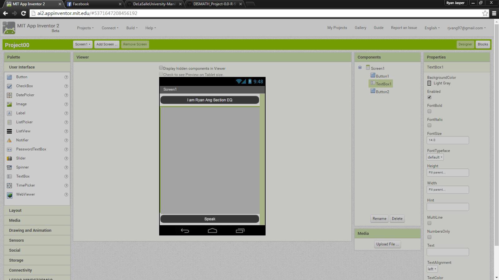
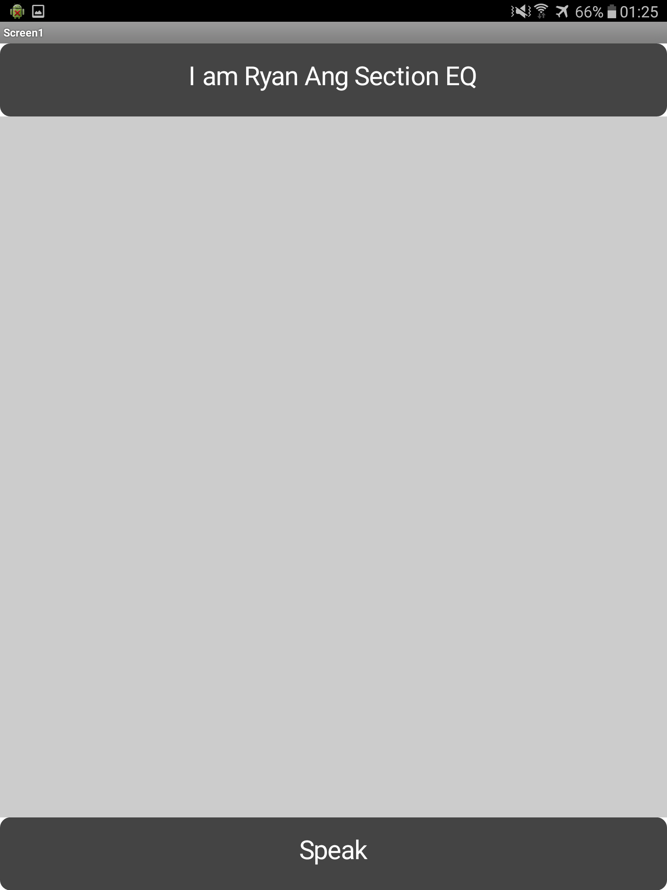
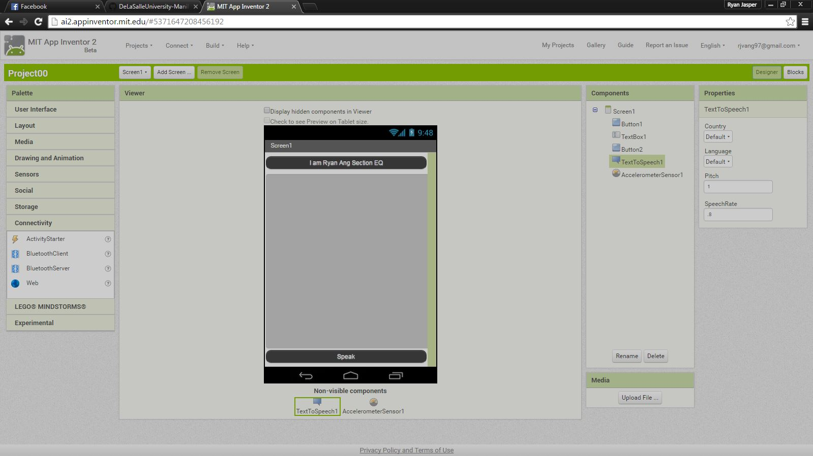
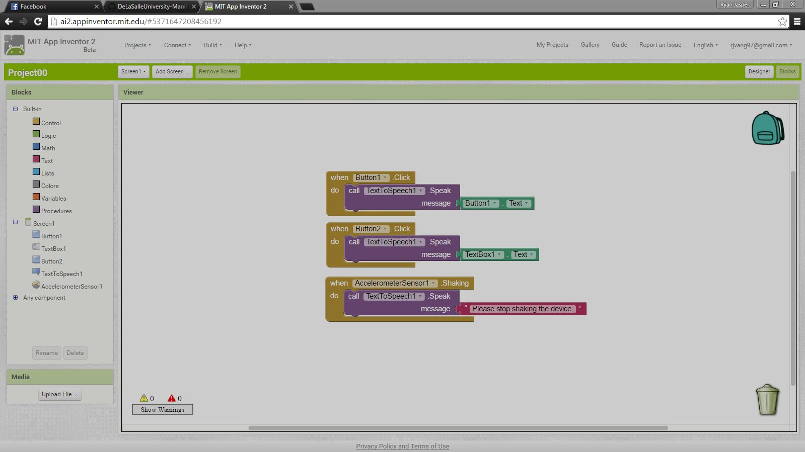
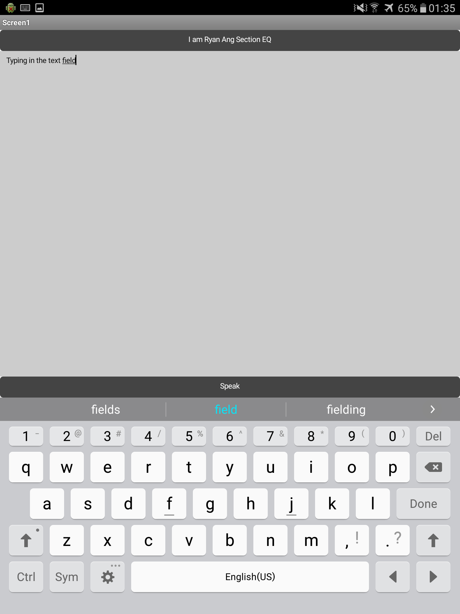

# DISMATH_Project-0.0-R-97
DISMATH_Project-0.0-R-97 created by R-97
 || 2016-02-24 Creation of a mobile app

=============================================

#Screenshots

1. Creating app in MIT App Inventor 2 at http://ai2.appinventor.mit.edu/
  

2. Testing app on Android device via MIT AI2 Companion.
  

3. Adding non-visible components to app.
  

4. Blocks tab view of app on MIT App Inventor 2.
  

5. Typing in the text field of the app on an Android device.
  

=============================================
